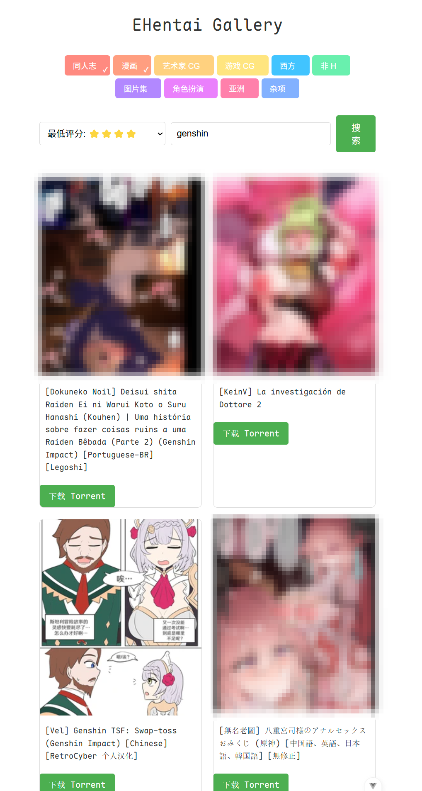

## EHenatai Gallery

> 本项目图一乐，毕竟只是做个简单的搜索
> 也许以后会加上预览和下载吧~
>> 开始画饼

### 环境准备

#### 后端安装

API 默认端口：8000

```bash
uv sync
cd backend
uvicorn main:app --reload
# 如果在服务器上请添加如下参数
uvicorn main:app --reload --host 0.0.0.0
```
#### 前端安装

UI 默认端口：5173

```bash
cd frontend
pnpm i
pnpm run dev
# 或者使用 npm
npm i
npm run dev
```
> 如果在服务器上请修改 `package.json` 和 `src/App.vue` 中内容

```json
"dev": "vite --host 0.0.0.0",
```

```js
const API_BASE_URL = 'http://<your_server_ip>:8000'
```

### 使用方式

运行前请在 `backend` 目录下创建 `config.toml` 文件用于记录 cookie，格式如下：

```toml
[cookies]
ipb_member_id = 
ipb_pass_hash = "xxx"

# 可选
[proxy]
proxy = "http://127.0.0.1:7890"

```

#### 预览
